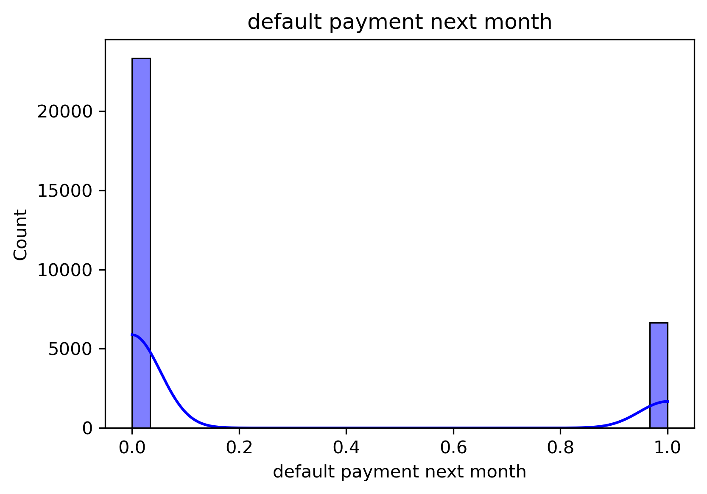
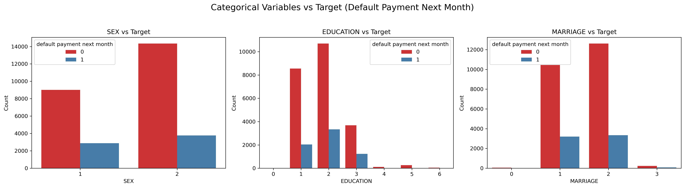
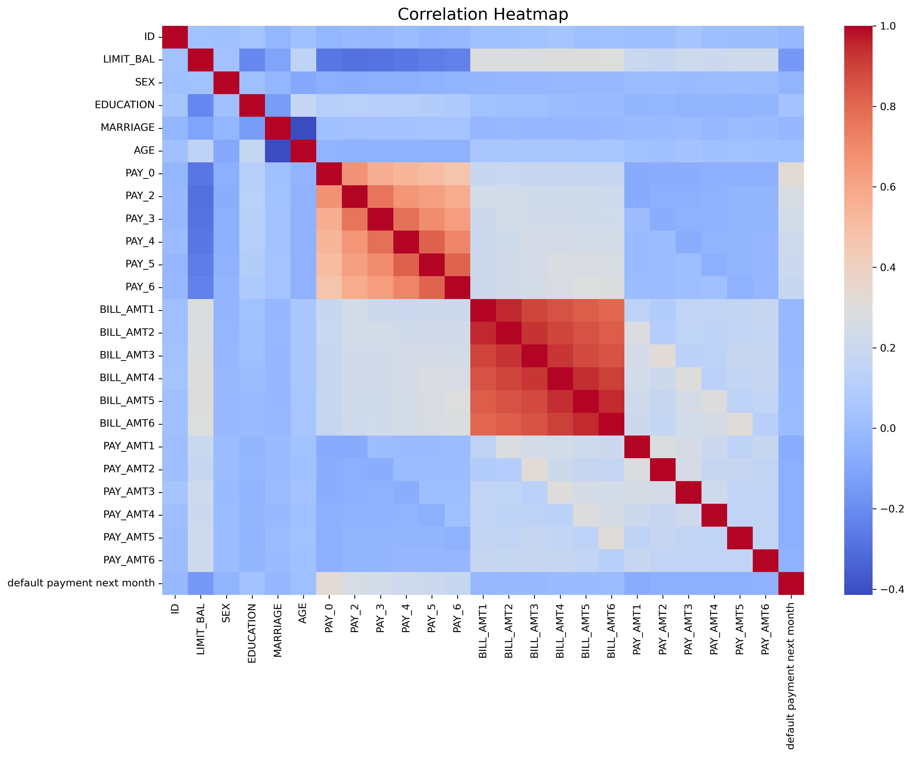
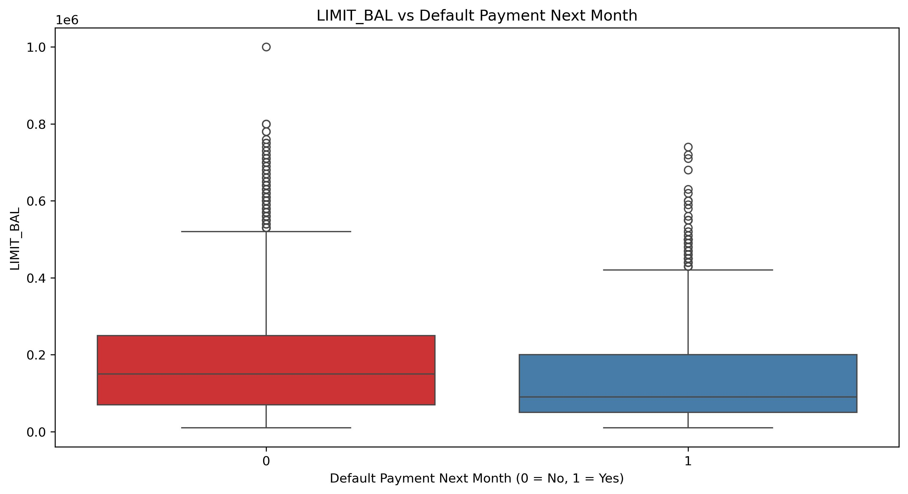
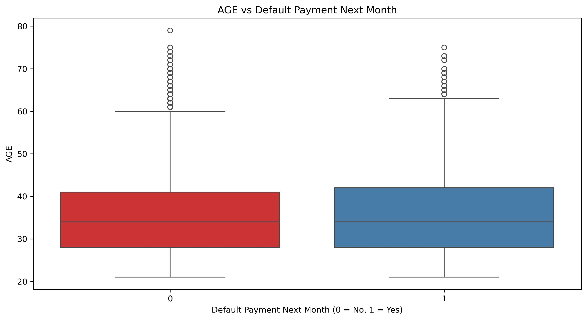
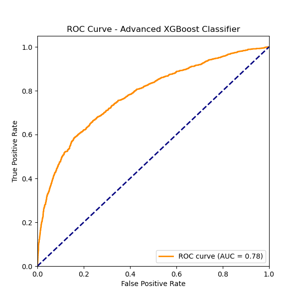

# Credit Risk Analysis

This project analyzes credit card default behavior using machine learning.  
The main goal is to **predict default probability** for each customer and evaluate different models under a reproducible pipeline.

*Author: Moshu Huang*  
*If you share this work, please credit the author and link back to this repository. :)*  

## Research Workflow

To make this project easy to follow, here’s the overall research pipeline I designed:

1. **Exploratory Data Analysis (EDA) 🔍**  
   - Understand dataset distribution, detect imbalances, and explore relationships between features and default behavior.  
   - This step gave me the first intuition of which variables might matter most.

2. **Initial Feature Engineering 🛠️**  
   - Clean categorical variables (e.g., EDUCATION, MARRIAGE), fix outliers, and drop irrelevant columns.  
   - Generate a clean processed dataset for modeling.

3. **Baseline Models ⚖️**  
   - **Logistic Regression**: simple, interpretable linear benchmark.  
   - **XGBoost**: strong non-linear baseline for tabular data.  

4. **Advanced Feature Engineering 🔬**  
   - Create additional signals: ratio features, trend features, behavioral features, aggregation features, and interaction terms.  
   - These features capture repayment dynamics beyond raw columns.

5. **Advanced Models 🚀**  
   - **Advanced Logistic Regression** with engineered features.  
   - **Advanced XGBoost Classifier** with engineered features.  
   - Additional comparisons with **Random Forest** and **LightGBM** for completeness.

6. **Hyperparameter Tuning 🎛️**  
   - Apply RandomizedSearchCV on XGBoost to push performance further.  
   - Tune parameters like learning rate, max depth, subsample ratio, and regularization.

7. **Final Comparison & Recommendation ✅**  
   - Evaluate models based on Accuracy, ROC-AUC, Precision, and Recall for defaults.  
   - Select the **Tuned XGBoost** as the final model, since it achieved the best balance of performance and interpretability.  

👉 Quick visual roadmap:  
**EDA 🔍 → Initial FE 🛠️ → Baseline ⚖️ → Advanced FE 🔬 → Advanced Models 🚀 → Hyperparameter Tuning 🎛️ → Final Recommendation ✅**

## EDA Analysis Report

My exploratory data analysis highlights key patterns in credit card default behavior.  
We observed target imbalance, strong correlations with repayment history, and significant outliers in financial variables.  
These insights guide feature engineering and model selection.

- **Imbalanced target**: ~22% default vs 78% non-default.  
  

- **Education & marriage**: Lower education groups show higher default; both married and single groups have notable default rates.  
  

- **Repayment history**: PAY_0 to PAY_6 strongly correlate with default status.  
  

- **Credit limit & bills**: Defaulters tend to have lower credit limits; bill/payment amounts are highly skewed with extreme outliers.  
  

- **Age**: Limited predictive power, with median in early 30s.  
  

## Feature Engineering

In this project, I split feature engineering into **two stages**:  
👉 *Initial Feature Engineering* (basic cleaning & encoding) vs.  
👉 *Advanced Feature Engineering* (new signals beyond raw variables).

### Initial Feature Engineering
The goal here was to clean and structure the raw dataset into something models can directly learn from:
- Fix invalid values in categorical features (e.g., merging rare categories in **EDUCATION** and **MARRIAGE**)  
- Encode categorical variables (binary mapping for **SEX**, one-hot for multi-category features)  
- Remove irrelevant or redundant columns (like **ID**)  
- Ensure correct dtypes for numeric vs categorical variables  

This stage gave us the **processed_data_initial.csv** dataset, a clean baseline input.

### Advanced Feature Engineering
To strengthen signals beyond the raw cleaned dataset, I engineered additional features:  

- **Ratio Features**  
  Utilization ratio (bill / limit), payment-to-bill ratio, payment-to-limit ratio  

- **Trend Features**  
  Growth ratios for bill amounts, payments, and bill–payment difference over 6 months  

- **Behavioral Features**  
  Number of overdue months, maximum overdue severity, consecutive overdue streaks, full repayment counts  

- **Aggregation Features**  
  Mean, standard deviation, and maximum of bills and payments  

- **Interaction Features**  
  Age × Credit Limit, Education × Credit Limit  

This stage produced the **processed_data_advanced.csv**, with richer signals to capture borrower dynamics and repayment behavior.  

✨ In short: *Initial FE* made the dataset clean and usable, while *Advanced FE* injected new business-driven insights to help models differentiate between defaulters and non-defaulters more effectively.

## Modeling Strategy

The modeling was carried out in **four stages**, moving from simple interpretable baselines to advanced, tuned models.  
The main evaluation metric was **ROC-AUC**, with special attention to **recall on the default (minority) class**.

### 1. Baseline Models
- **Logistic Regression**: serves as an interpretable linear baseline.  
  - Result: Accuracy ~0.78, ROC-AUC ~0.64.  
  - Limitation: failed to capture default class (recall ≈ 0), showing the dataset requires non-linear methods.
- **XGBoost (baseline)**: chosen as a strong non-linear benchmark for tabular data.  
  - Result: Accuracy ~0.82, ROC-AUC ~0.78, Class-1 Precision ~0.67, Recall ~0.36.  
  - Takeaway: already captures non-linearities and class imbalance better.

### 2. Advanced Models (with engineered features)
- Built on additional ratio, trend, behavioral, aggregation, and interaction features.  
- **Advanced Logistic Regression**: small improvement in ROC-AUC (~0.67), but recall for defaults remained extremely low (~0.03).  
- **Advanced XGBoost**: performance plateaued (ROC-AUC ~0.78), indicating tree-based models already learned much of the same structure from raw inputs.

### 3. Additional Comparisons
To benchmark against other ensemble learners:
- **Random Forest**: Accuracy ~0.81, ROC-AUC ~0.76. Similar recall to baseline XGBoost but slightly weaker on AUC.  
- **LightGBM**: Accuracy ~0.82, ROC-AUC ~0.77. Competitive and efficient, but marginally behind XGBoost on this dataset.

### 4. Hyperparameter Tuning
- Conducted **RandomizedSearchCV** with 3-fold cross-validation on XGBoost, exploring tree depth, learning rate, subsample ratios, and regularization.  
- **Tuned XGBoost**: Accuracy ~0.82, ROC-AUC ~0.782 (best overall).  
- Interpretation: tuning delivered a modest but consistent AUC gain, confirming XGBoost as the most effective model for this task.

## Summary & Final Recommendation

- Logistic regression provided interpretability but lacked predictive power.  
- Tree-based methods (XGBoost, Random Forest, LightGBM) dominated performance, with XGBoost consistently leading.  
- **Tuned XGBoost** is selected as the final model, with ROC-AUC ~0.782 and accuracy ~0.82.  
- It not only delivers strong predictive power but also outputs **default probability scores**, enabling direct business applications.  

Example of predicted default probabilities (first 10 cases from test set):  
`[0.1276, 0.1362, 0.1788, 0.1468, 0.0434, 0.5581, 0.1067, 0.0221, 0.1265, 0.0525]`

## Model Performance Comparison

| Model                  | Accuracy | ROC-AUC | Precision (Default=1) | Recall (Default=1) |
|-------------------------|----------|---------|------------------------|--------------------|
| Logistic Regression     | ~0.78    | 0.63 → **0.67** | 0.44 | 0.03 |
| XGBoost (Baseline)      | ~0.82    | ~0.78   | 0.65 | 0.36 |
| Random Forest           | ~0.81    | ~0.76   | 0.63 | 0.37 |
| LightGBM                | ~0.81    | ~0.77   | 0.65 | 0.36 |
| **Tuned XGBoost**       | **0.82** | **0.782** | 0.67 | 0.36 |

ROC Curves are saved under the `reports/` folder. Example:  

## Business Use Cases

This project demonstrates how machine learning can enhance credit risk analysis:  

- **Credit risk management**: Rank customers by predicted default risk and adjust credit limits.  
- **Early warning system**: Identify high-risk clients for proactive intervention.  
- **Portfolio monitoring**: Aggregate default probabilities for stress testing and scenario analysis.  

✨ This repository provides a full pipeline:  
**Raw data → EDA → Feature Engineering → Modeling → Hyperparameter Tuning → Business Insights**

*Authored by: Moshu Huang*  